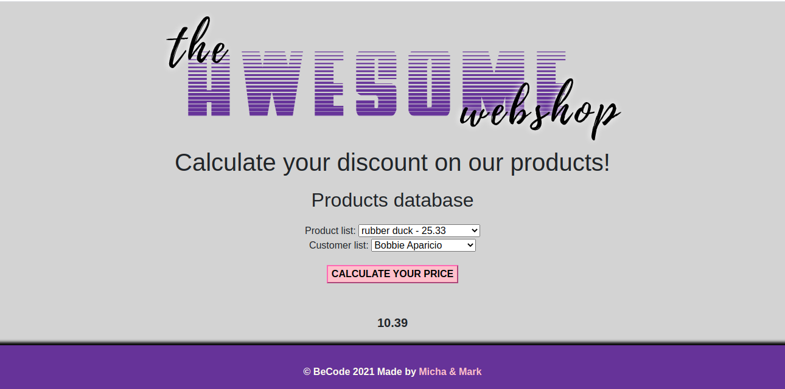

# PHP Price Calculator

### A project created by team of two students of BeCode during our web development training.

>[Michaela Harinova](https://github.com/mharin)     
>[Marcel Hoogkamer](https://github.com/MarcelHoogkamer)

#### This project is a "learning challenge" type when we are working with OOP in PHP while using MVC model and basic working with database.
#### We learn and improve basic understanding of OOP, MVC model and also implement a mathematical approach of code within PHP.

## Used technologies:
- PHP (OOP)
- CSS
- HTML
- MVC model

## Learning objectives
> - Apply basic OOP principles      
> - Import data with a database     
> - Learn to use an MVC

## The Mission
#### Combine your OOP knowledge with a database.

> #### Make a price calculator with the following entities:
> - Customer 
> - A customer group 
> - A product    

> #### This project was created based on specific conditions for all calculations that were already given.
>
> - Work with two type of discounts - fixed and variable(%)
> - Count a final price for each customer with specific discounts of them or group that they were part of
> - Figure out how to get the correct prices for each option and combination.

## Interface of Price calculator
>#### Starting screen
>

>#### After counting price with dicount
>

